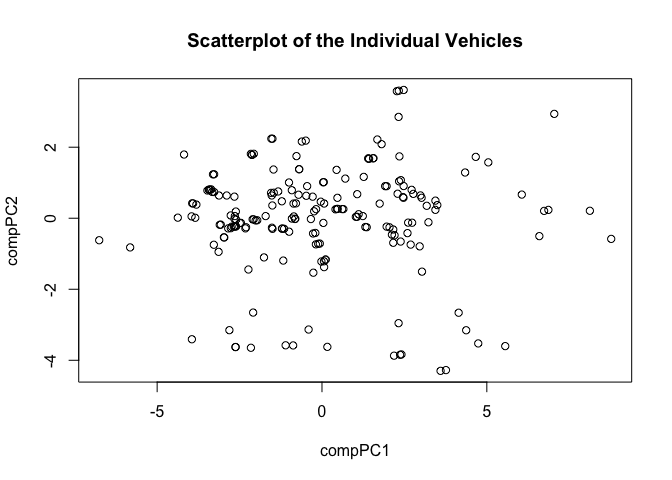

hw01-julie-song
================
Julie Song
2/19/2018

### 1) Data Dictionary (10 pts)

-   [data\_dictionary](https://github.com/stat133-sp18/hw-stat133-msong2016/blob/master/hw01/imports-85-dictionary.md)

### 2) Data Import (20 pts)

-   Creating a character vector for column names

``` r
column_names = c('symboling', 'normalized_losses', 'make', 'fuel_type', 'aspiration', 'num_of_doors', 'body_style', 'drive_wheels', 'engine_location', 'wheel_base', 'length', 'width', 'height', 'curb_weight', 'engine_type', 'num_of_cylinders', 'engine_size', 'fuel_system', 'bore', 'stroke', 'compression_ratio', 'horsepower', 'peak_rpm', 'city_mpg', 'highway_mpg', 'price')
```

-   using read.csv function:

``` r
auto_import1 = read.csv(
  file = 'imports-85.data', 
  col.names = column_names, 
  na.strings = "?", 
  sep = ",",
  header = FALSE,
  colClasses = c(
    "real", 
    "real", 
    "character", 
    "character",
    "character",
    "character",
    "character",
    "character",
    "character", 
    "real", 
    "real", 
    "real", 
    "real", 
    "integer", 
    "character",
    "character",
    "integer", 
    "character",
    "real", 
    "real", 
    "real", 
    "integer", 
    "integer", 
    "integer", 
    "integer", 
    "integer"
  )
)
str(auto_import1)
```

    ## 'data.frame':    205 obs. of  26 variables:
    ##  $ symboling        : num  3 3 1 2 2 2 1 1 1 0 ...
    ##  $ normalized_losses: num  NA NA NA 164 164 NA 158 NA 158 NA ...
    ##  $ make             : chr  "alfa-romero" "alfa-romero" "alfa-romero" "audi" ...
    ##  $ fuel_type        : chr  "gas" "gas" "gas" "gas" ...
    ##  $ aspiration       : chr  "std" "std" "std" "std" ...
    ##  $ num_of_doors     : chr  "two" "two" "two" "four" ...
    ##  $ body_style       : chr  "convertible" "convertible" "hatchback" "sedan" ...
    ##  $ drive_wheels     : chr  "rwd" "rwd" "rwd" "fwd" ...
    ##  $ engine_location  : chr  "front" "front" "front" "front" ...
    ##  $ wheel_base       : num  88.6 88.6 94.5 99.8 99.4 ...
    ##  $ length           : num  169 169 171 177 177 ...
    ##  $ width            : num  64.1 64.1 65.5 66.2 66.4 66.3 71.4 71.4 71.4 67.9 ...
    ##  $ height           : num  48.8 48.8 52.4 54.3 54.3 53.1 55.7 55.7 55.9 52 ...
    ##  $ curb_weight      : int  2548 2548 2823 2337 2824 2507 2844 2954 3086 3053 ...
    ##  $ engine_type      : chr  "dohc" "dohc" "ohcv" "ohc" ...
    ##  $ num_of_cylinders : chr  "four" "four" "six" "four" ...
    ##  $ engine_size      : int  130 130 152 109 136 136 136 136 131 131 ...
    ##  $ fuel_system      : chr  "mpfi" "mpfi" "mpfi" "mpfi" ...
    ##  $ bore             : num  3.47 3.47 2.68 3.19 3.19 3.19 3.19 3.19 3.13 3.13 ...
    ##  $ stroke           : num  2.68 2.68 3.47 3.4 3.4 3.4 3.4 3.4 3.4 3.4 ...
    ##  $ compression_ratio: num  9 9 9 10 8 8.5 8.5 8.5 8.3 7 ...
    ##  $ horsepower       : int  111 111 154 102 115 110 110 110 140 160 ...
    ##  $ peak_rpm         : int  5000 5000 5000 5500 5500 5500 5500 5500 5500 5500 ...
    ##  $ city_mpg         : int  21 21 19 24 18 19 19 19 17 16 ...
    ##  $ highway_mpg      : int  27 27 26 30 22 25 25 25 20 22 ...
    ##  $ price            : int  13495 16500 16500 13950 17450 15250 17710 18920 23875 NA ...

-   using read\_csv() from R package "readr"

``` r
library(readr)
auto_import2 = read_csv(
  file = 'imports-85.data', 
  na = c("?"),  
  col_names = column_names, 
  col_types = list(
    symboling = col_double(), 
    normalized_losses = col_double(),
    make = col_character(), 
    fuel_type = col_character(),
    aspiration = col_character(), 
    num_of_doors = col_character(), 
    body_style = col_character(), 
    drive_wheels = col_character(), 
    engine_location = col_character(), 
    wheel_base = col_double(), 
    length = col_double(), 
    width = col_double(), 
    height = col_double(), 
    curb_weight = col_integer(), 
    engine_type = col_character(), 
    num_of_cylinders = col_character(), 
    engine_size = col_integer(), 
    fuel_system = col_character(), 
    bore = col_double(), 
    stroke = col_double(), 
    compression_ratio = col_double(), 
    horsepower = col_integer(), 
    peak_rpm = col_integer(), 
    city_mpg = col_integer(), 
    highway_mpg = col_integer(), 
    price = col_integer()
  )
)
str(auto_import2)
```

    ## Classes 'tbl_df', 'tbl' and 'data.frame':    205 obs. of  26 variables:
    ##  $ symboling        : num  3 3 1 2 2 2 1 1 1 0 ...
    ##  $ normalized_losses: num  NA NA NA 164 164 NA 158 NA 158 NA ...
    ##  $ make             : chr  "alfa-romero" "alfa-romero" "alfa-romero" "audi" ...
    ##  $ fuel_type        : chr  "gas" "gas" "gas" "gas" ...
    ##  $ aspiration       : chr  "std" "std" "std" "std" ...
    ##  $ num_of_doors     : chr  "two" "two" "two" "four" ...
    ##  $ body_style       : chr  "convertible" "convertible" "hatchback" "sedan" ...
    ##  $ drive_wheels     : chr  "rwd" "rwd" "rwd" "fwd" ...
    ##  $ engine_location  : chr  "front" "front" "front" "front" ...
    ##  $ wheel_base       : num  88.6 88.6 94.5 99.8 99.4 ...
    ##  $ length           : num  169 169 171 177 177 ...
    ##  $ width            : num  64.1 64.1 65.5 66.2 66.4 66.3 71.4 71.4 71.4 67.9 ...
    ##  $ height           : num  48.8 48.8 52.4 54.3 54.3 53.1 55.7 55.7 55.9 52 ...
    ##  $ curb_weight      : int  2548 2548 2823 2337 2824 2507 2844 2954 3086 3053 ...
    ##  $ engine_type      : chr  "dohc" "dohc" "ohcv" "ohc" ...
    ##  $ num_of_cylinders : chr  "four" "four" "six" "four" ...
    ##  $ engine_size      : int  130 130 152 109 136 136 136 136 131 131 ...
    ##  $ fuel_system      : chr  "mpfi" "mpfi" "mpfi" "mpfi" ...
    ##  $ bore             : num  3.47 3.47 2.68 3.19 3.19 3.19 3.19 3.19 3.13 3.13 ...
    ##  $ stroke           : num  2.68 2.68 3.47 3.4 3.4 3.4 3.4 3.4 3.4 3.4 ...
    ##  $ compression_ratio: num  9 9 9 10 8 8.5 8.5 8.5 8.3 7 ...
    ##  $ horsepower       : int  111 111 154 102 115 110 110 110 140 160 ...
    ##  $ peak_rpm         : int  5000 5000 5000 5500 5500 5500 5500 5500 5500 5500 ...
    ##  $ city_mpg         : int  21 21 19 24 18 19 19 19 17 16 ...
    ##  $ highway_mpg      : int  27 27 26 30 22 25 25 25 20 22 ...
    ##  $ price            : int  13495 16500 16500 13950 17450 15250 17710 18920 23875 NA ...
    ##  - attr(*, "spec")=List of 2
    ##   ..$ cols   :List of 26
    ##   .. ..$ symboling        : list()
    ##   .. .. ..- attr(*, "class")= chr  "collector_double" "collector"
    ##   .. ..$ normalized_losses: list()
    ##   .. .. ..- attr(*, "class")= chr  "collector_double" "collector"
    ##   .. ..$ make             : list()
    ##   .. .. ..- attr(*, "class")= chr  "collector_character" "collector"
    ##   .. ..$ fuel_type        : list()
    ##   .. .. ..- attr(*, "class")= chr  "collector_character" "collector"
    ##   .. ..$ aspiration       : list()
    ##   .. .. ..- attr(*, "class")= chr  "collector_character" "collector"
    ##   .. ..$ num_of_doors     : list()
    ##   .. .. ..- attr(*, "class")= chr  "collector_character" "collector"
    ##   .. ..$ body_style       : list()
    ##   .. .. ..- attr(*, "class")= chr  "collector_character" "collector"
    ##   .. ..$ drive_wheels     : list()
    ##   .. .. ..- attr(*, "class")= chr  "collector_character" "collector"
    ##   .. ..$ engine_location  : list()
    ##   .. .. ..- attr(*, "class")= chr  "collector_character" "collector"
    ##   .. ..$ wheel_base       : list()
    ##   .. .. ..- attr(*, "class")= chr  "collector_double" "collector"
    ##   .. ..$ length           : list()
    ##   .. .. ..- attr(*, "class")= chr  "collector_double" "collector"
    ##   .. ..$ width            : list()
    ##   .. .. ..- attr(*, "class")= chr  "collector_double" "collector"
    ##   .. ..$ height           : list()
    ##   .. .. ..- attr(*, "class")= chr  "collector_double" "collector"
    ##   .. ..$ curb_weight      : list()
    ##   .. .. ..- attr(*, "class")= chr  "collector_integer" "collector"
    ##   .. ..$ engine_type      : list()
    ##   .. .. ..- attr(*, "class")= chr  "collector_character" "collector"
    ##   .. ..$ num_of_cylinders : list()
    ##   .. .. ..- attr(*, "class")= chr  "collector_character" "collector"
    ##   .. ..$ engine_size      : list()
    ##   .. .. ..- attr(*, "class")= chr  "collector_integer" "collector"
    ##   .. ..$ fuel_system      : list()
    ##   .. .. ..- attr(*, "class")= chr  "collector_character" "collector"
    ##   .. ..$ bore             : list()
    ##   .. .. ..- attr(*, "class")= chr  "collector_double" "collector"
    ##   .. ..$ stroke           : list()
    ##   .. .. ..- attr(*, "class")= chr  "collector_double" "collector"
    ##   .. ..$ compression_ratio: list()
    ##   .. .. ..- attr(*, "class")= chr  "collector_double" "collector"
    ##   .. ..$ horsepower       : list()
    ##   .. .. ..- attr(*, "class")= chr  "collector_integer" "collector"
    ##   .. ..$ peak_rpm         : list()
    ##   .. .. ..- attr(*, "class")= chr  "collector_integer" "collector"
    ##   .. ..$ city_mpg         : list()
    ##   .. .. ..- attr(*, "class")= chr  "collector_integer" "collector"
    ##   .. ..$ highway_mpg      : list()
    ##   .. .. ..- attr(*, "class")= chr  "collector_integer" "collector"
    ##   .. ..$ price            : list()
    ##   .. .. ..- attr(*, "class")= chr  "collector_integer" "collector"
    ##   ..$ default: list()
    ##   .. ..- attr(*, "class")= chr  "collector_guess" "collector"
    ##   ..- attr(*, "class")= chr "col_spec"

### 3) Technical Questions about importing data (10 pts)

**a) If you don’t provide a vector of column names, what happens to the column names of the imported data when you simply invoke read.csv('imports-85.data')?**

-   The first row of the data becomes recognized as the column names (header) of the imported data.

**b) If you don’t provide a vector of column names, what happens to the column names of the imported data when you invoke read.csv('imports-85.data', header = FALSE)?**

-   The first row no longer is the header; it is recognized as one of the rows for data and header is replaced with "V1", "V2", ..., "V26".

**c) When using the reading table functions, if you don’t specify how missing values are codified, what happens to the data type of those columns that contain '?', e.g. price or num\_of\_doors?**

-   Data type of columns that contain '?' will be factors. This can be seen by the code: str(read.csv('imports-85.data', header = FALSE)) for num\_of\_doors or price.

**d) Why is the data frame imported in the second option bigger (in terms of bytes) than the data frame imported in the first option?**

-   In the first option, without specifying the data type, R automatically stores factor in data frame as numbers, which takes up less memory space than storing some of them as characters because numbers only take up one letter, while character take up at least more than one letter. In the second option, if we specify data types and if some of them are stored as characters, it will take up more letters, meaning that it will take up more space (1 letter = 8 bytes), so data frame imported in the second option will be bigger in terms of bytes.

**e) Say the object dat is the data frame produced when importing imports-85.data. What happens to the data values if you convert dat as an R matrix?**

-   Data frame allows data types to be preserved, so each variables or list or columns can have different data types. However, when dat converted into R matrix, every data values must all have the same data type, so if imports-85.data is converted to R matrix, because some of the data values are stored as characters, it's going to make entire data type of R matrix as characters.

4) Practice base plotting (10pts)
---------------------------------

**histogram of price with colored bars**

-   This is a histogram that demonstrates the distribution of individual vehicles according to their price. Because price values are continuous, histogram is appropriate to be used to represent the data and each bin represents ranges of prices. Here, we can observe that majority of the vehicles are in the price range between 0 to 10,000.

``` r
hist(auto_import1$price, col = c(5, 7), main = "Histogram of Price for imports-85.data", xlab = "Price")
```


**boxplot of horsepower in horizontal orientation**

-   This is a boxplot of horsepower in horizontal orietnation and we can see the summary of the data. From this boxplot, we can tell that the minimum is around 50, maximum is around 290, first quartile is around 70, third quartile is around 120, and median is around 95. Points that are beyond maximum are potential outliers.

``` r
max(na.omit(auto_import1$horsepower))
```

    ## [1] 288

``` r
boxplot(auto_import1$horsepower, horizontal = TRUE, col = 7, main = "Boxplot of Horsepower", xlab = "horsepower")
```


**barplot of the frequencies of body\_style, arranged in decreasing order**

-   This is a barplot of body style, arranged in decreasing order by the frequency. Because body style is a categorical data, barplot is appropriate for use. From this barplot, we can tell that sedan is the most common body type and convertible is the least common body type among vehicles.

``` r
sorted = sort(table(auto_import1$body_style), decreasing = TRUE)
barplot(sorted, main = "Barplot of the Frequencies of Body Style", xlab = "Body Style", ylab = "Frequency")
```


**stars() plot of vehicles with turbo aspiration, using only variables wheel-base, length, width, height, and price.**

-   This is a stars plot of vehicles with turbo aspiration with the variables listed above and stars plot is appropriate in this case because it is useful when displaying multivariable observations of the data. Each vertex of the stars represent each variables and the length of the star extended towards certain vertex represents the size of the variable for data point of a particular vehicle relative to the maximum size of the variable across all other data points that represents all other vehicles. From this graph, it seems like vehicle with index number 9, 71, 70, 69, 68, 117, 118, 202, 204, and 205 seems to be well balanced in its magnitude for all five variables.

``` r
stars(auto_import1[auto_import1$aspiration == "turbo", c('wheel_base', 'length', 'width', 'height', 'price')], main = "Starsplot of Vehicles with Turbo Aspiration")
```


### 5) Summaries (10 pts)

**a) What is the mean price of fuel\_type gas cars? And what is the mean price of fuel\_type diesel cars? (removing missing values)**

``` r
gas_price = na.omit(auto_import1[auto_import1$fuel_type == 'gas', 'price'])
mean(gas_price)
```

    ## [1] 12916.41

``` r
diesel_price = na.omit(auto_import1[auto_import1$fuel_type == 'diesel', 'price'])
mean(diesel_price)
```

    ## [1] 15838.15

**b) What is the make of the car with twelve num\_of\_cylinders?**

``` r
num_of_cylinders12 = auto_import1[auto_import1$num_of_cylinders == 'twelve', ]
make12 = num_of_cylinders12[1, 'make']
make12
```

    ## [1] "jaguar"

**c) What is the make that has the most diesel cars?**

``` r
which.max(table(na.omit(auto_import1[auto_import1$fuel_type == 'diesel', 'make'])))
```

    ## peugot 
    ##      4

**d) What is the price of the car with the largest amount of horsepower?**

``` r
auto_import1[which.max(auto_import1$horsepower), 'price'] #Price of the car with largest amount of horsepower = NA (missing value)
```

    ## [1] NA

``` r
auto2 = na.omit((auto_import1[ , c('horsepower', 'price')]))
auto2[which.max(auto2$horsepower), 'price'] #Price of the car with largest amount of horsepower after removing NA's in both horsepower and price
```

    ## [1] 36000

**e) What is the bottom 10th percentile of city\_mpg?**

``` r
city_mpg1 = auto_import1$city_mpg
quantile(city_mpg1, .10)
```

    ## 10% 
    ##  17

**f) What is the top 10th percentile of highway\_mpg?**

``` r
highway_mpg1 = auto_import1$highway_mpg
quantile(highway_mpg1, .90)
```

    ## 90% 
    ##  38

**g) What is the median price of those cars in the bottom 10th percentile of city\_mpg?**

``` r
ten_city_mpg_df = na.omit(auto_import1[auto_import1$city_mpg <= quantile(city_mpg1, .10), 'price'])
median(ten_city_mpg_df)
```

    ## [1] 32250

### 6) Technical Questions about data frames (10 pts)

**a) What happens when you use the dollar operator on a data frame, attempting to use the name of a column that does not exist?**

-   it outputs "NULL" because dollar operator when used on data frame allows us to retrieve columns through names and when we call a name of a column that does not exist, it should output NULL because it's undefined.

**b) Which of the following commands fails to return the vector mpg which is a column in the built-in data frame mtcar?**

-   mtcars\[ ,mpg\] failed; others all works.

**c) Based on your answer for part (b), what is the reason that makes such command to fail?**

-   we need "" around the column name because column name should be recognized by R as a string. Because names are stored as strings, we need "" to indicate that it's a string.

**d) Can you include an R list as a “column” of a data frame? YES or NO, and why.**

-   Yes, because data frame itself is a special type of list. We can confirm this by running the code: is.list(mtcar), where mtcars is a data frame. List can also take both vectors and factors. Thus, we can include an R list as the column of the data frame.

**e) What happens when you apply as.list() to a data frame? e.g. as.list(mtcars)**

-   After applying as.list() to the data frame, it no longer is data frame, but it doesn't change the data types of each variables.

**f) Consider the command: abc &lt;- as.list(mtcars). What function(s) can you use to convert the object abc into a data frame?**

-   as.data.frame(abc)
-   data.frame(abc)

### 7) Correlations of quantitative variables (10 pts)

-   plotting 2 correlograms:

``` r
library(corrplot)
```

    ## corrplot 0.84 loaded

``` r
qdat = na.omit(subset(auto_import1, select = c( 'length', 'width', 'height', 'curb_weight', 'engine_size', 'bore', 'stroke', 'compression_ratio', 'horsepower', 'peak_rpm', 'city_mpg', 'highway_mpg', 'price', 'wheel_base')))
cor_qdat = cor(qdat)
               
corrplot(cor_qdat, method = "circle", order = 'hclust')
```


``` r
corrplot(cor_qdat, method = "ellipse", order = 'hclust')
```


-   From the two correlogram, we can observe that variables that are located on the bottom right corner have mostly strong positive correlation. The positive correlation is denoted with blue color and the strength of the correlation is denoted by how dark the blue color is, as seen by legend on the right side of the correlogram. The relationships between these values are demonstrating strong positive correlation: price and engin size, price and horsepower, price and curb weight, price and length, curb weight and length, curb weight and width, wheel base and width, etc. This logically makes sense because if the length and width are large, curb weight will increase, and more expensive cars will have big engines and large size cars in general.

-   If we move further to the left, we see high degree of negative correlation. This negative correlation is represented in both of the correlograms by red color and the strength of the correlation is denoted by how dark the red color is, which can be seen by legend on the right of the correlogram. Thus, we can see strong negative correlation between city mpg and wheelbase, width, length, curb weight, bore, horsepower, engine size and price and same thing for highway mpg and those other variables listed. This also makes general sense because if the car is larger, higher curb weight, expensive, and have big engines, their focus is on the speed of the car, not how efficient it is in using fuel. So, it will have lower mpg compared to other cars that are cheaper and has focus on saving fuel.

### 8) Principal Components Analysis (20 pts)

#### 8.1) Run PCA (10 pts)

**Use prcomp() to perform a principal components analysis on qdat; use the argument scale. = TRUE to carry out PCA on standardized data**

``` r
pca = prcomp(qdat, scale. = TRUE)
pca
```

    ## Standard deviations (1, .., p=14):
    ##  [1] 2.7444153 1.5097122 1.1027842 0.9537375 0.7803475 0.6447513 0.5662146
    ##  [8] 0.5197552 0.3468564 0.3325672 0.2856364 0.2534176 0.2267083 0.1403524
    ## 
    ## Rotation (n x k) = (14 x 14):
    ##                           PC1          PC2         PC3         PC4
    ## length             0.32846158 -0.163361793  0.12744458 -0.14708138
    ## width              0.32387774 -0.125794575 -0.05159710 -0.09327862
    ## height             0.11093310 -0.399505972  0.47616754 -0.39155982
    ## curb_weight        0.35188704 -0.061690513 -0.05439206  0.01531897
    ## engine_size        0.32195403  0.080699454 -0.25006815  0.18207249
    ## bore               0.25921783  0.003813116  0.16639019  0.39377173
    ## stroke             0.05246970 -0.114613607 -0.70435429 -0.47906205
    ## compression_ratio  0.01456148 -0.520135281 -0.28357924  0.16841754
    ## horsepower         0.29789335  0.301937846 -0.14137051  0.08579386
    ## peak_rpm          -0.08117128  0.446147534  0.05814015 -0.52744444
    ## city_mpg          -0.30909009 -0.272494571 -0.11401133  0.08571829
    ## highway_mpg       -0.31920231 -0.222155076 -0.11501526  0.08841510
    ## price              0.31851813  0.069950904 -0.13480231  0.10734760
    ## wheel_base         0.28820539 -0.291822882  0.12994231 -0.24040455
    ##                            PC5          PC6         PC7         PC8
    ## length             0.007462052 -0.003281959  0.22826758 -0.01685486
    ## width             -0.128866810 -0.123638324  0.45853571 -0.19737255
    ## height             0.001618322  0.081959274 -0.60515036  0.02555923
    ## curb_weight       -0.057461684 -0.045545593  0.01314028  0.13585260
    ## engine_size       -0.083906981 -0.175158702 -0.26926446 -0.24075452
    ## bore               0.317119243  0.763826825  0.02922983 -0.22251589
    ## stroke             0.433100016  0.194370109 -0.13551220 -0.01413997
    ## compression_ratio -0.498544456  0.316232642  0.06588965  0.47639736
    ## horsepower        -0.131012718  0.065151100 -0.23999786  0.05342361
    ## peak_rpm          -0.489851393  0.440721180  0.12239852 -0.12411071
    ## city_mpg          -0.155027565  0.034015804 -0.02754798 -0.45872657
    ## highway_mpg       -0.140578296  0.063399817 -0.06133115 -0.46950783
    ## price             -0.365732305 -0.109866699 -0.33519865 -0.26642750
    ## wheel_base         0.040390152 -0.091044654  0.29280991 -0.29480758
    ##                           PC9        PC10         PC11        PC12
    ## length            -0.44759966  0.27680872  0.647147529 -0.17005108
    ## width              0.66047755  0.36152498 -0.099554205 -0.07695175
    ## height             0.17854610  0.16431334 -0.096188616 -0.06889848
    ## curb_weight       -0.18337772  0.05790402 -0.161246477 -0.21907848
    ## engine_size       -0.21247520 -0.01837147 -0.320178658 -0.56903676
    ## bore               0.09483889 -0.07068087 -0.003634347 -0.03958635
    ## stroke             0.07256394 -0.02523594  0.084270274  0.02514953
    ## compression_ratio -0.03006785 -0.07136841 -0.064175833  0.02516110
    ## horsepower        -0.17987925  0.54412613 -0.184023017  0.57937605
    ## peak_rpm          -0.07551295 -0.06706146 -0.077802479 -0.17709794
    ## city_mpg          -0.10042010  0.13943000 -0.142429780 -0.03719344
    ## highway_mpg       -0.12840259  0.27943585  0.164571125  0.08029781
    ## price              0.26801914 -0.43598268  0.459085844  0.20917748
    ## wheel_base        -0.31803097 -0.40383755 -0.352478872  0.40884789
    ##                           PC13         PC14
    ## length            -0.152920764  0.164388742
    ## width             -0.059479953 -0.022591691
    ## height            -0.037851269 -0.012020057
    ## curb_weight        0.849862076 -0.109225303
    ## engine_size       -0.382542972 -0.088442773
    ## bore               0.009110184  0.005699296
    ## stroke             0.020361037  0.022922714
    ## compression_ratio -0.170130520 -0.030438648
    ## horsepower        -0.072408918  0.087583765
    ## peak_rpm           0.012866553 -0.020721489
    ## city_mpg           0.186412547  0.698240708
    ## highway_mpg        0.096685755 -0.665040758
    ## price              0.117105656  0.068127984
    ## wheel_base        -0.101872047 -0.092324032

**Examine the eigenvalues and determine the proportion of variation that is “captured”by the first three components**

``` r
eigen = pca$sdev^2
eigen_perc = 100 * eigen / sum(eigen)
eigen_cum = cumsum(eigen_perc)

eigs_df <- data.frame(
  eigenvalue = eigen,
  percentage = eigen_perc,
  'cumulative percentage' = eigen_cum
)

print(round(eigs_df, 4), print.gap = 2)
```

    ##     eigenvalue  percentage  cumulative.percentage
    ## 1       7.5318     53.7987                53.7987
    ## 2       2.2792     16.2802                70.0789
    ## 3       1.2161      8.6867                78.7656
    ## 4       0.9096      6.4973                85.2628
    ## 5       0.6089      4.3496                89.6124
    ## 6       0.4157      2.9693                92.5817
    ## 7       0.3206      2.2900                94.8717
    ## 8       0.2701      1.9296                96.8013
    ## 9       0.1203      0.8594                97.6607
    ## 10      0.1106      0.7900                98.4507
    ## 11      0.0816      0.5828                99.0335
    ## 12      0.0642      0.4587                99.4922
    ## 13      0.0514      0.3671                99.8593
    ## 14      0.0197      0.1407               100.0000

``` r
barplot(eigen[1:3], border = NA, las = 1, names.arg = paste('PC', 1:3), 
        main = 'Barchart of Eigenvalues')
```


#### 8.2) PCA plot of vehicles, and PCA plot of variables (10 pts)

**Use the first two components to graph a scatterplot of the vehicles (do not use "ggplot2" functions)**

``` r
compPC1 = pca$x[ ,1]
compPC2 = pca$x[ ,2]
plot(compPC1 , compPC2, main = "Scatterplot of the Individual Vehicles")
```



**Use the first two loadings (i.e. eigenvectors) to graph the variables**

``` r
loadPC1 = pca$rotation[ ,1]
loadPC2 = pca$rotation[ ,2]
plot(loadPC1, loadPC2, main = "Scatterplot of the Variables")
```


**Optionally, you can call biplot() of the "prcomop" object to get a simultaneous plot of both the vehicles and the variables**

``` r
biplot(pca, scale = 0)
```


**Based on the previous plots, provide a concise description of the patterns that you observe**

-   From the scatterplot of the vehicles, each point represents each vehicles in terms of pca matrix of principal components. It seems like the majority of the vehicles are not too extreme on either PC1 (first principal component) or PC2 (second principal component). However, I do see some outliers, such as vehicle points that are located at the far extreme ends of PC1 and PC 2.

-   From the scatterplot of the variables, each point represents loadings or weights for each variables. Here, we can observe that many points are located at the extreme right-end of PC1. Also, unlike vehicle scatterplot, points here seem to be located more at extreme ends of PC1 and PC2, as there's only a single point near the origin (PC1, PC2) = (0, 0).
