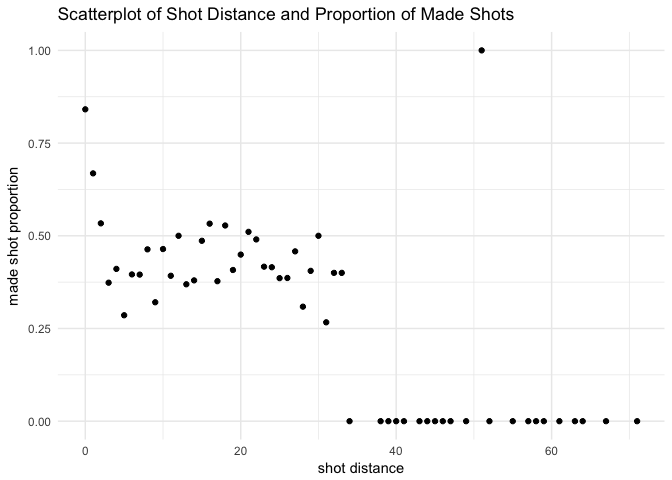
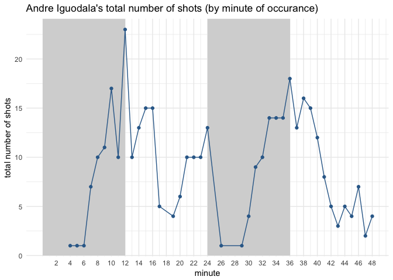
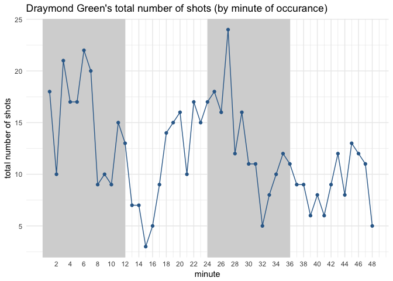
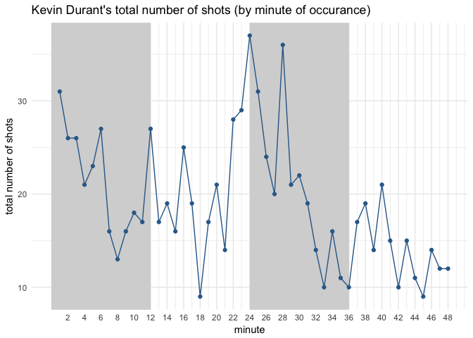
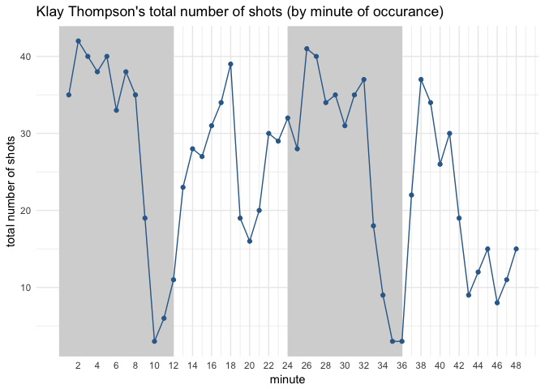
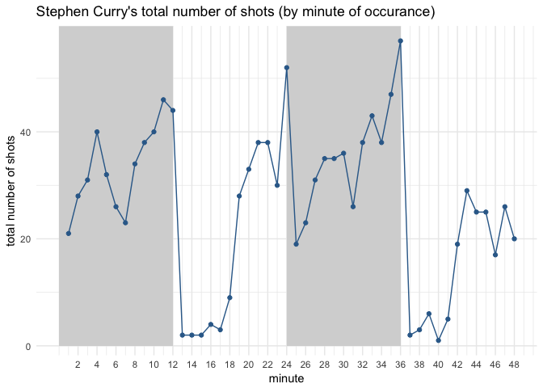
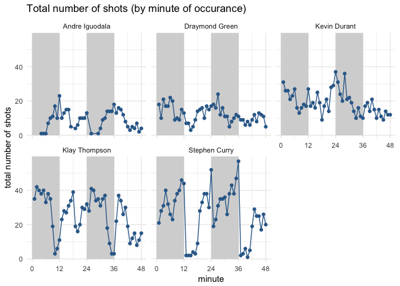

HW 02 - Shot Charts
================
Julie Song

### 5) Summary Tables (20pts)

#### 5.1) Total Shots by Player (10pts)

``` r
library(dplyr)
```

    ## 
    ## Attaching package: 'dplyr'

    ## The following objects are masked from 'package:stats':
    ## 
    ##     filter, lag

    ## The following objects are masked from 'package:base':
    ## 
    ##     intersect, setdiff, setequal, union

``` r
library(ggplot2)
shots_data = read.csv("../data/shots-data.csv")
```

``` r
#Total number of shots by player in descending order
shots_data %>%
  group_by(name) %>%
  summarize(total = length(shot_type)) %>%
  arrange(desc(total))
```

    ## # A tibble: 5 x 2
    ##   name           total
    ##   <fct>          <int>
    ## 1 Stephen Curry   1250
    ## 2 Klay Thompson   1220
    ## 3 Kevin Durant     915
    ## 4 Draymond Green   578
    ## 5 Andre Iguodala   371

#### 5.2) Effective Shooting Percentage (10 pts)

``` r
#Effective Shooting % by Player

merge(shots_data %>%
  group_by(name) %>%
  summarize(total = length(shot_type)),
  shots_data %>%
  filter(shot_made_flag == 'made shot') %>%
  group_by(name) %>%
  summarize(made = length(shot_made_flag))
  ) %>%
  mutate(perc_made = made / total) %>%
  arrange(desc(perc_made))
```

    ##             name total made perc_made
    ## 1   Kevin Durant   915  495 0.5409836
    ## 2 Andre Iguodala   371  192 0.5175202
    ## 3  Klay Thompson  1220  575 0.4713115
    ## 4  Stephen Curry  1250  584 0.4672000
    ## 5 Draymond Green   578  245 0.4238754

``` r
#2PT Effective Shooting % by player

merge(
  shots_data %>%
  filter(shot_type == '2PT Field Goal') %>%
  group_by(name) %>%
  summarize(total = length(shot_type)) , 
  shots_data %>%
  filter(shot_made_flag == 'made shot' & shot_type == '2PT Field Goal') %>%
  group_by(name) %>%
  summarize(made = length(shot_type))
  ) %>%
  mutate(perc_made = made / total) %>%
  arrange(desc(perc_made))
```

    ##             name total made perc_made
    ## 1 Andre Iguodala   210  134 0.6380952
    ## 2   Kevin Durant   643  390 0.6065319
    ## 3  Stephen Curry   563  304 0.5399645
    ## 4  Klay Thompson   640  329 0.5140625
    ## 5 Draymond Green   346  171 0.4942197

``` r
#3PT Effective Shooting % by player

merge(
  shots_data %>%
  filter(shot_type == '3PT Field Goal') %>%
  group_by(name) %>%
  summarize(total = length(shot_type)) ,
  shots_data %>%
  filter(shot_made_flag == 'made shot' & shot_type == '3PT Field Goal') %>%
  group_by(name) %>%
  summarize(made = length(shot_type))
  ) %>%
  mutate(perc_made = made / total) %>%
  arrange(desc(perc_made))
```

    ##             name total made perc_made
    ## 1  Klay Thompson   580  246 0.4241379
    ## 2  Stephen Curry   687  280 0.4075691
    ## 3   Kevin Durant   272  105 0.3860294
    ## 4 Andre Iguodala   161   58 0.3602484
    ## 5 Draymond Green   232   74 0.3189655

### 6) Shooting Distance (20pts)

#### 6.1 dplyr table (10pts)

``` r
shot_dist = merge(
  shots_data %>%
  group_by(shot_distance) %>%
  summarise(total_shots = length(shot_made_flag)) ,
  shots_data %>%
  group_by(shot_distance) %>%
    summarize(total_made = sum(shot_made_flag == 'made shot'))
  ) %>%
  group_by(shot_distance) %>%
  summarise(made_shot_prop = total_made / total_shots)
shot_dist
```

    ## # A tibble: 56 x 2
    ##    shot_distance made_shot_prop
    ##            <int>          <dbl>
    ##  1             0          0.841
    ##  2             1          0.668
    ##  3             2          0.534
    ##  4             3          0.373
    ##  5             4          0.411
    ##  6             5          0.286
    ##  7             6          0.396
    ##  8             7          0.395
    ##  9             8          0.463
    ## 10             9          0.321
    ## # ... with 46 more rows

#### 6.2 ggplot (10pts)

``` r
ggplot(shot_dist, aes(x = shot_distance, y = made_shot_prop)) + geom_point() + labs(x = 'shot distance', y = 'made shot proportion', title = 'Scatterplot of Shot Distance and Proportion of Made Shots') + theme_minimal()
```



**1) What do you observe?**

-   From the graph above, I can observe that the closer the shot distance is, more likely for players to make the shot successfully. Shots that are taken within 0 to 2 ft proportions are noticeably higher than made shot proprtions at longer distances. Then, made shot proportions from distance 3 ft to about 33 ft seem to be quite similar, ranging between proportion of about 0.26 to 0.5. Further we go in terms of shot distance, we see that made shot proportion is zero, with shot taken from 51ft as an outlier.

**2) Can you confirm that the shorter the distance, the more effective the shots?**

-   From this scatterplot, it demonstrates some negative relationship between shot distance and made shot proportions, meaing that shorter the distance, hiehger made shot proportions. So, from this scatterplot, we can confirm our original hypothesis.

**3) Can you guesstimate a distance threshold beyond which the chance of making a successful shot is basically null?**

-   Around 33ft from the graph.

**4) What distances tend to have a percentage (of making a shot) of 50% or more?**

-   0, 1, 2, 12, 16, 18, 21, 30, 51 ft, which can be confirmed by following code:

``` r
shot_dist %>%
  filter(made_shot_prop >= 0.5)
```

    ## # A tibble: 9 x 2
    ##   shot_distance made_shot_prop
    ##           <int>          <dbl>
    ## 1             0          0.841
    ## 2             1          0.668
    ## 3             2          0.534
    ## 4            12          0.500
    ## 5            16          0.533
    ## 6            18          0.528
    ## 7            21          0.511
    ## 8            30          0.500
    ## 9            51          1.00

### 7) Total number of shots by minute of occurance (10pts)

``` r
#For individual players: 
andre_shots = shots_data %>%
  filter(name == 'Andre Iguodala') %>%
  select(minute, shot_made_flag) %>%
  group_by(minute) %>%
  summarize(total = sum(shot_made_flag == 'made shot' | shot_made_flag == 'missed shot')) %>%
  mutate(name = rep('Andre Iguodala'))


andre_shots %>%
ggplot(aes(x = minute, y = total)) + 
  geom_rect(fill = 'grey80', alpha = 0.04, xmin = 0, xmax=12, ymin=0, ymax=60)+
  geom_rect(fill = 'grey80', alpha = 0.04, xmin = 24, xmax=36, ymin=0, ymax=60) + 
  geom_point(aes(color = 1)) +
  scale_x_continuous(limits = c(0, 48), breaks = seq(from=2, to =48, by = 2)) + 
  geom_path(aes(color = 1))  + 
  theme_minimal()  + 
  labs( x = 'minute', y = 'total number of shots', title = "Andre Iguodala's total number of shots (by minute of occurance)") + 
  theme(legend.position="none")
```



``` r
draymond_shots = shots_data %>%
  filter(name == 'Draymond Green') %>%
  select(minute, shot_made_flag) %>%
  group_by(minute) %>%
  summarize(total = sum(shot_made_flag == 'made shot' | shot_made_flag == 'missed shot')) %>%
  mutate(name = rep('Draymond Green'))

draymond_shots %>%
ggplot(aes(x = minute, y = total)) + 
  geom_rect(fill = 'grey80', alpha = 0.04, xmin = 0, xmax=12, ymin=0, ymax=60)+
  geom_rect(fill = 'grey80', alpha = 0.04, xmin = 24, xmax=36, ymin=0, ymax=60) + 
  geom_point(aes(color = 1)) +
  scale_x_continuous(limits = c(0, 48), breaks = seq(from=2, to =48, by = 2)) + 
  geom_path(aes(color = 1))  + 
  theme_minimal()  + 
  labs( x = 'minute', y = 'total number of shots', title = "Draymond Green's total number of shots (by minute of occurance)") + 
  theme(legend.position="none")
```



``` r
kevin_shots = shots_data %>%
  filter(name == 'Kevin Durant') %>%
  select(minute, shot_made_flag) %>%
  group_by(minute) %>%
  summarize(total = sum(shot_made_flag == 'made shot' | shot_made_flag == 'missed shot')) %>%
  mutate(name = rep('Kevin Durant'))

kevin_shots %>%
ggplot(aes(x = minute, y = total)) + 
  geom_rect(fill = 'grey80', alpha = 0.04, xmin = 0, xmax=12, ymin=0, ymax=60)+
  geom_rect(fill = 'grey80', alpha = 0.04, xmin = 24, xmax=36, ymin=0, ymax=60) + 
  geom_point(aes(color = 1)) +
  scale_x_continuous(limits = c(0, 48), breaks = seq(from=2, to =48, by = 2)) + 
  geom_path(aes(color = 1))  + 
  theme_minimal()  + 
  labs( x = 'minute', y = 'total number of shots', title = "Kevin Durant's total number of shots (by minute of occurance)") + 
  theme(legend.position="none")
```



``` r
klay_shots = shots_data %>%
  filter(name == 'Klay Thompson') %>%
  select(minute, shot_made_flag) %>%
  group_by(minute) %>%
  summarize(total = sum(shot_made_flag == 'made shot' | shot_made_flag == 'missed shot')) %>%
  mutate(name = rep('Klay Thompson'))

klay_shots %>%
ggplot(aes(x = minute, y = total)) + 
  geom_rect(fill = 'grey80', alpha = 0.04, xmin = 0, xmax=12, ymin=0, ymax=60)+
  geom_rect(fill = 'grey80', alpha = 0.04, xmin = 24, xmax=36, ymin=0, ymax=60) + 
  geom_point(aes(color = 1)) +
  scale_x_continuous(limits = c(0, 48), breaks = seq(from=2, to =48, by = 2)) + 
  geom_path(aes(color = 1))  + 
  theme_minimal()  + 
  labs( x = 'minute', y = 'total number of shots', title = "Klay Thompson's total number of shots (by minute of occurance)") + 
  theme(legend.position="none")
```



``` r
stephen_shots = shots_data %>%
  filter(name == 'Stephen Curry') %>%
  select(minute, shot_made_flag) %>%
  group_by(minute) %>%
  summarize(total = sum(shot_made_flag == 'made shot' | shot_made_flag == 'missed shot')) %>%
  mutate(name = rep('Stephen Curry'))

stephen_shots %>%
ggplot(aes(x = minute, y = total)) + 
  geom_rect(fill = 'grey80', alpha = 0.04, xmin = 0, xmax=12, ymin=0, ymax=60)+
  geom_rect(fill = 'grey80', alpha = 0.04, xmin = 24, xmax=36, ymin=0, ymax=60) + 
  geom_point(aes(color = 1)) +
  scale_x_continuous(limits = c(0, 48), breaks = seq(from=2, to =48, by = 2)) + 
  geom_path(aes(color = 1))  + 
  theme_minimal()  + 
  labs( x = 'minute', y = 'total number of shots', title = "Stephen Curry's total number of shots (by minute of occurance)") + 
  theme(legend.position="none")
```



``` r
# Facetted graph for all players:
rbind(klay_shots, stephen_shots, draymond_shots, kevin_shots, andre_shots) %>%
  ggplot(aes(x = minute, y = total)) + 
  geom_rect(fill = 'grey80', alpha = 0.04, xmin = 0, xmax=12, ymin=0, ymax=60)+
  geom_rect(fill = 'grey80', alpha = 0.04, xmin = 24, xmax=36, ymin=0, ymax=60) + 
  geom_point(aes(color = 1)) +
  scale_x_continuous(limits = c(0, 48), breaks = seq(from=0, to =48, by = 12)) + 
  geom_path(aes(color = 1))  + 
  theme_minimal()  + 
  labs( x = 'minute', y = 'total number of shots', title = "Total number of shots (by minute of occurance)") + 
  theme(legend.position="none") + 
  facet_wrap(~name)
```


