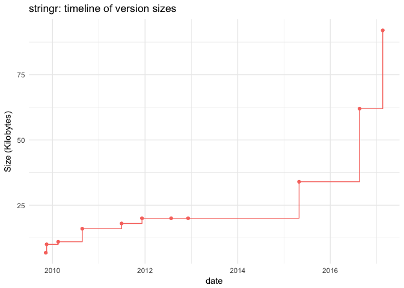
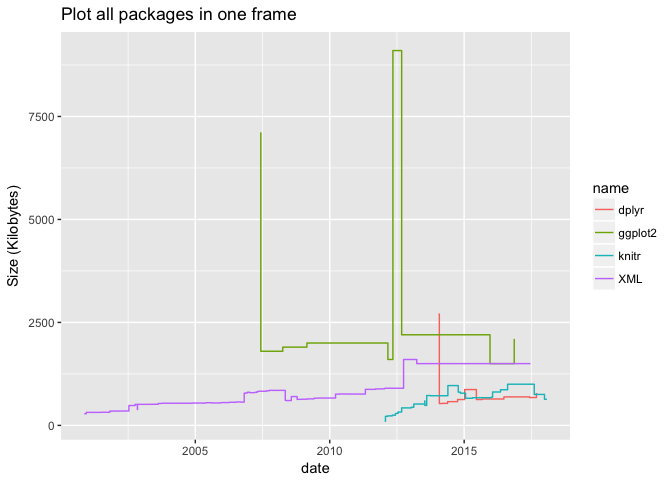
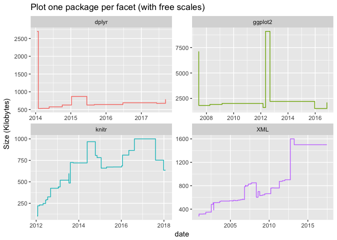
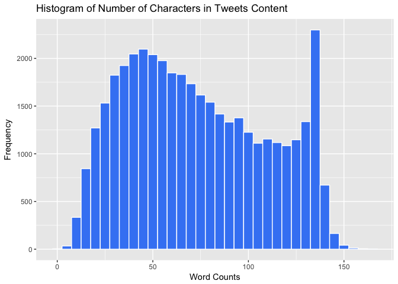
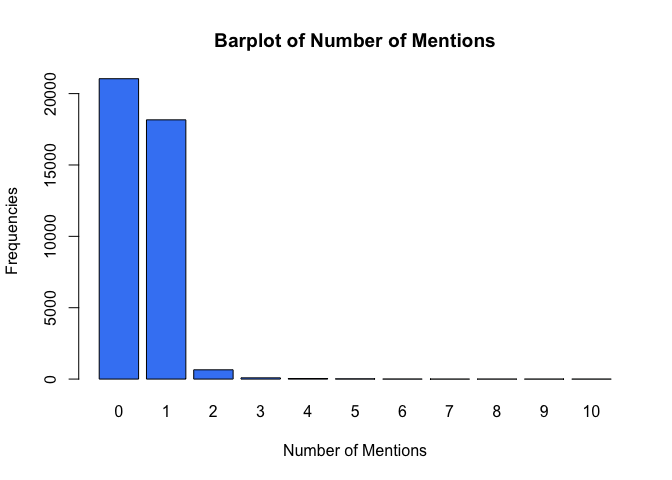
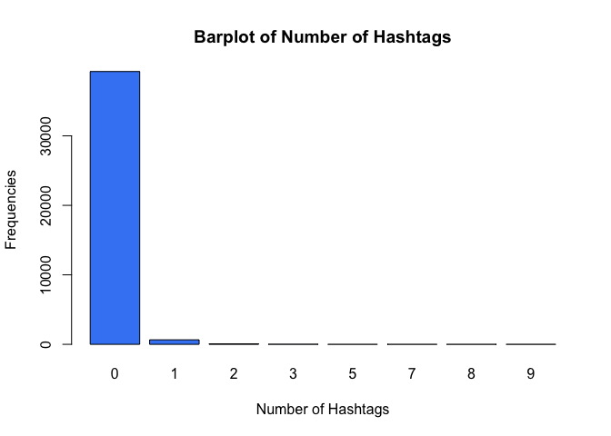

hw04-julie-song
================
Julie Song
4/6/2018

``` r
knitr::opts_chunk$set(echo = TRUE, error = TRUE, fig.path = '../images/')
```

``` r
library(stringr)
library(ggplot2)
library(dplyr)
```

    ## 
    ## Attaching package: 'dplyr'

    ## The following objects are masked from 'package:stats':
    ## 
    ##     filter, lag

    ## The following objects are masked from 'package:base':
    ## 
    ##     intersect, setdiff, setequal, union

1.4 Archive of 'stringr'
========================

``` r
source('../code/archive-functions.R')
```

``` r
raw_data <- read_archive('stringr')
clean_data <- clean_archive(raw_data)
plot_archive(clean_data)
```



1.5 Archives of 'dplyr', 'ggplot2', 'XML', and 'knitr'
======================================================

``` r
#Exporting each table as csv file: 

#ggplot2 csv file: 
ggplot_read <- read_archive('ggplot2')
ggplot_clean <- clean_archive(ggplot_read)
write.csv(ggplot_clean, file = '../data/ggplot2-archive.csv')

#xml csv file: 
xml_read <- read_archive('XML')
xml_clean <- clean_archive(xml_read)
write.csv(xml_clean, file = '../data/XML-archive.csv')

#knitr csv file:
knitr_read <- read_archive('knitr')
knitr_clean <- clean_archive(knitr_read)
write.csv(knitr_clean, file = '../data/knitr-archive.csv')

#dplyr csv file: 
dplyr_read <- read_archive('dplyr')
dplyr_clean <- clean_archive(dplyr_read)
write.csv(dplyr_clean, file = '../data/dplyr-archive.csv')
```

``` r
# combining all data table into one single data frame

all <- rbind(dplyr_clean, ggplot_clean, knitr_clean, xml_clean)

#using ggplot2 to create two step line charts

#plot all packages in one frame

ggplot(all, aes(x = date, y = size)) + geom_step(aes(color = name)) + labs(title = 'Plot all packages in one frame', x = 'date', y = 'Size (Kilobytes)')
```



``` r
#plot one package per facet (with free scales)

ggplot(all, aes(x = date, y = size)) + geom_step(aes(color = name)) + facet_wrap(~name, scales = 'free') + theme(legend.position="none") + 
  labs(title = 'Plot one package per facet (with free scales)', x = 'date', y = 'Size (Kilobytes)')
```



3 Data "Emotion in Text"
========================

``` r
emotion <- read.csv('../data/text-emotion.csv')
```

3.1 Number of characters per tweet
==================================

``` r
#Count number of characters in the tweet contents

counts <- rep(0)
for (i in 1:length(emotion$content)) {
  counts[i] <- nchar(as.character(emotion[i, 4]), type = 'chars')
}

table(counts)
```

    ## counts
    ##   1   6   7   8   9  10  11  12  13  14  15  16  17  18  19  20  21  22 
    ##   4   2  32  41  48  60  76 109 126 161 142 182 233 231 258 231 264 287 
    ##  23  24  25  26  27  28  29  30  31  32  33  34  35  36  37  38  39  40 
    ## 308 304 296 301 323 339 345 349 401 390 382 393 343 398 409 410 413 393 
    ##  41  42  43  44  45  46  47  48  49  50  51  52  53  54  55  56  57  58 
    ## 416 414 390 398 428 410 471 422 413 408 393 403 413 381 410 407 365 368 
    ##  59  60  61  62  63  64  65  66  67  68  69  70  71  72  73  74  75  76 
    ## 376 371 386 347 364 362 381 357 368 360 357 355 333 329 334 322 303 311 
    ##  77  78  79  80  81  82  83  84  85  86  87  88  89  90  91  92  93  94 
    ## 346 325 299 295 309 313 310 296 268 260 283 295 272 260 260 246 304 271 
    ##  95  96  97  98  99 100 101 102 103 104 105 106 107 108 109 110 111 112 
    ## 261 273 268 270 245 253 233 225 222 231 224 219 215 247 218 236 233 221 
    ## 113 114 115 116 117 118 119 120 121 122 123 124 125 126 127 128 129 130 
    ## 246 213 229 194 236 205 239 229 187 225 234 232 214 246 221 230 269 278 
    ## 131 132 133 134 135 136 137 138 139 140 141 142 143 144 145 146 147 148 
    ## 274 286 338 402 419 521 618 396  65  78  83  50  18  39  39  34  35  17 
    ## 149 150 151 152 153 154 155 156 157 158 160 161 166 167 
    ##   3   7   8   7   2   4   1   2   4   2   2   1   1   1

``` r
#display a summary() of counts

summary(counts)
```

    ##    Min. 1st Qu.  Median    Mean 3rd Qu.    Max. 
    ##    1.00   43.00   69.00   73.41  103.00  167.00

``` r
#plot a histogram of counts

ggplot(data.frame(counts), aes(x = counts)) + geom_histogram(binwidth = 5, fill = '#4286f4', color = 'white') + labs(x = 'Word Counts', y = 'Frequency', title = 'Histogram of Number of Characters in Tweets Content')
```



3.2 Number of Mentions
======================

``` r
#Count the number of @ mentions in the tweet contents

raw_id <- str_extract_all(emotion$content, '\\@\\w+')

count_id <- rep(0)
for (i in 1:length(emotion$content)) {
  if(sum(nchar(raw_id[[i]]) <= 16 & nchar(raw_id[[i]]) != 0) >= 1) {
    count_id[i] <- length(raw_id[[i]])
  } else {
    count_id[i] <- 0
  }
}

#display frequencies and barplot of counts

table(count_id)
```

    ## count_id
    ##     0     1     2     3     4     5     6     7     8     9    10 
    ## 21043 18162   649    86    34    16     5     1     2     1     1

``` r
barplot(table(count_id), xlab = 'Number of Mentions', ylab = 'Frequencies', main = 'Barplot of Number of Mentions', col = '#4286f4')
```



``` r
#display content of tweet with 10 mentions

emotion$content[count_id == 10]
```

    ## [1] last #ff  @Mel_Diesel @vja4041 @DemonFactory @shawnmcguirt @SEO_Web_Design @ChuckSwanson @agracing @confidentgolf @tluckow @legalblonde31
    ## 39827 Levels: - arrggh kids that won't settle....need some Kava for Liam, that'll sort 'em... ...

3.3 Hashtags
============

``` r
#Count the number of hashtags in the tweet contents

raw_hash_count <- str_extract_all(emotion$content, '#[A-Za-z]')

count_hash <- rep(0)
for (i in 1:length(emotion$content)) {
  if(length(raw_hash_count[[i]]) >= 1) {
   count_hash[i] <- length(raw_hash_count[[i]])
  } else {
    count_hash[i] <- 0
  }
}

#Display frequencies and barplot of counts

table(count_hash)
```

    ## count_hash
    ##     0     1     2     3     5     7     8     9 
    ## 39261   650    66    17     1     1     1     3

``` r
barplot(table(count_hash), xlab = 'Number of Hashtags', ylab = 'Frequencies', main = 'Barplot of Number of Hashtags', col = '#4286f4')
```



``` r
#Average length of hash tags and most common length

#Method one: 

raw_hash_one <- str_extract_all(emotion$content, '#[A-Za-z][A-Za-z0-9]*')
unlisted_one <- unlist(raw_hash_one)

hash_length_one <- nchar(unlisted_one) - 1

summary(hash_length_one)
```

    ##    Min. 1st Qu.  Median    Mean 3rd Qu.    Max. 
    ##   1.000   4.000   7.000   7.625  10.000  34.000

``` r
table(hash_length_one)
```

    ## hash_length_one
    ##  1  2  3  4  5  6  7  8  9 10 11 12 13 14 15 16 17 18 19 20 21 22 34 
    ##  1 71 74 97 74 59 75 73 97 51 54 63 18 22 27  7  6  3  2  2  2  1  1

``` r
#average: 7.625
#most common: length 4
which.max(table(hash_length_one))
```

    ## 4 
    ## 4

``` r
#Average length of hash tags and most common length

#Method two: 

raw_hash_two <- str_extract_all(emotion$content, '#[A-Za-z][A-Za-z0-9]*')

unlisted_two <- unlist(
  lapply(raw_hash_two, function(y) if (length(y) == 0) NULL else y [[1]])
)

hash_length_two <- str_count(unlisted_two) - 1

summary(hash_length_two)
```

    ##    Min. 1st Qu.  Median    Mean 3rd Qu.    Max. 
    ##   1.000   4.000   7.000   7.714  11.000  34.000

``` r
table(hash_length_two)
```

    ## hash_length_two
    ##  1  2  3  4  5  6  7  8  9 10 11 12 13 14 15 16 17 18 19 20 21 22 34 
    ##  1 69 61 75 63 45 64 62 57 48 53 57 18 18 24  7  6  3  2  2  2  1  1

``` r
#average: 7.714
#most common: length 4
which.max(table(hash_length_two))
```

    ## 4 
    ## 4
